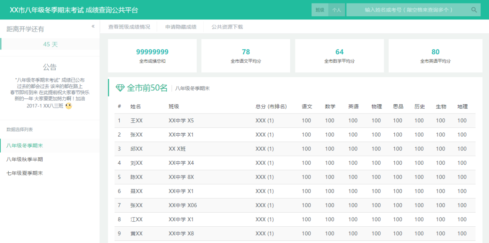

[WARNING] Zneiat/QwQuery 新版已 push，本项目已废弃，请 [点击这里查看](https://github.com/Zneiat/QwQuery)

光阴似水，日月如梭

这已是一个非常陈旧的作品，就当初学PHP时的留恋吧...

---

# scoreQuery

看名字就知道是一个考试成绩查询工具，用Php/Js/Css编写，AJAX 请求，支持单科排序，显示全市前50名，灵活处理数据......

## 截图

## 如何食用
配置 config.php 和 dbMap.json 文件即可

## License
Copyright (c) 2014-2017, Zneiat (MIT License)